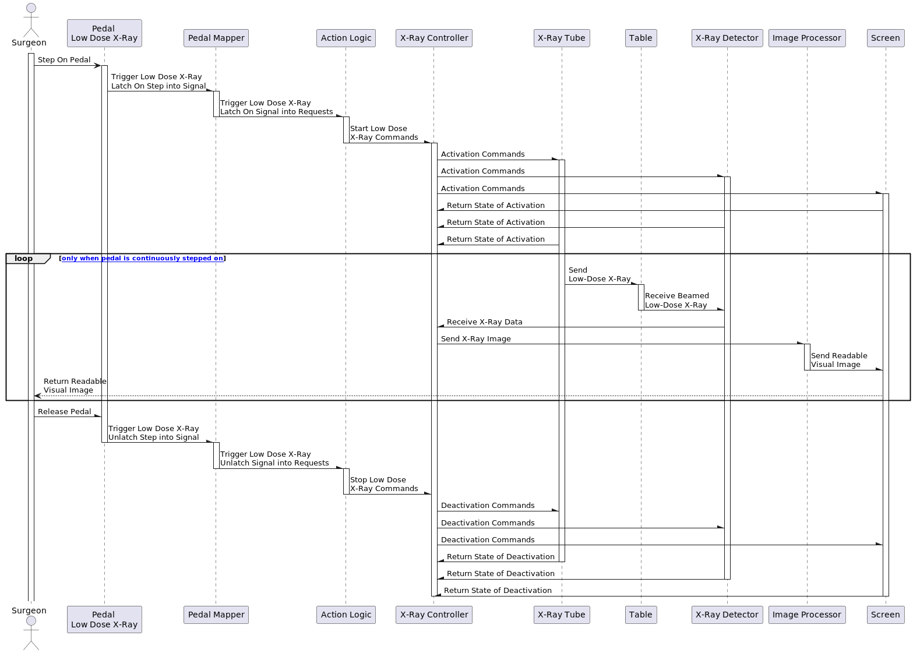
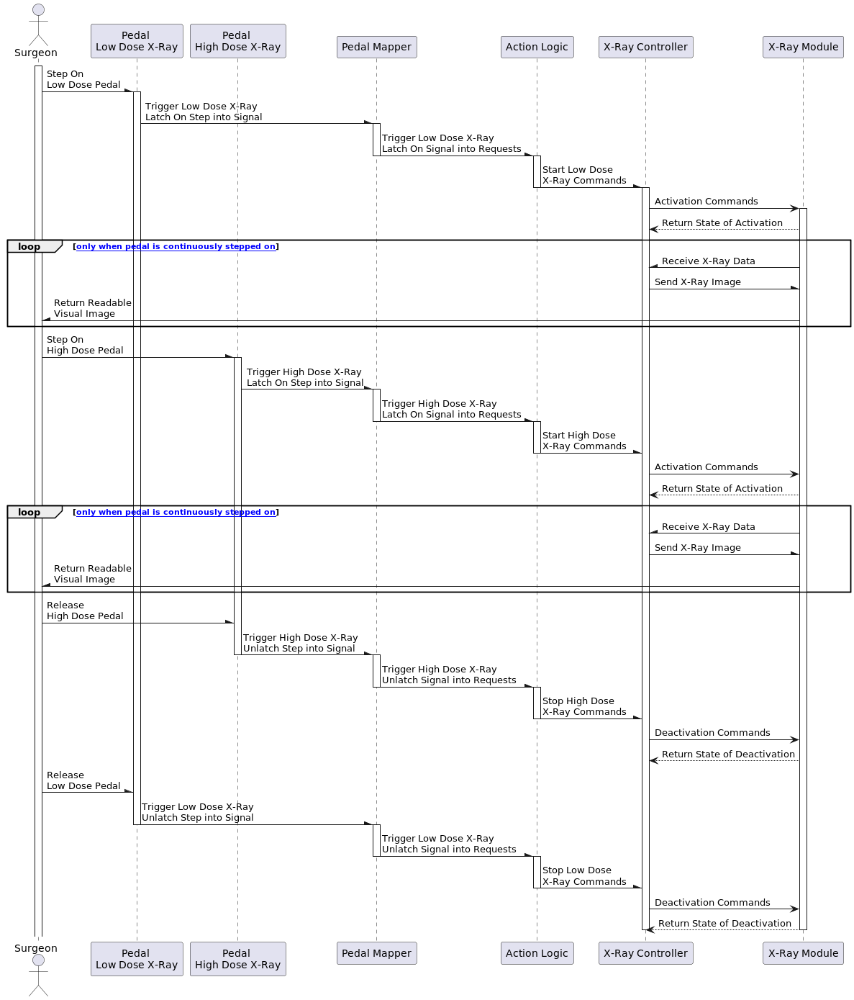

# UML
Your PlantUML diagrams should follow this naming scheme:
- Component diagram = `component.puml`
- Sequence diagrams
    - Configuration = `sequence-config.puml`
    - First pedal diagram = `sequence-pedal-1.puml`
    - Second pedal diagram = `sequence-pedal-2.puml`
- Class diagrams
    - Database = `class-database.puml`
    - High-level = `class-high-level.puml`
Exported images are named the same as the diagrams (expect for the file extension).
The report below is a Markdown document that covers the team's modeling decisions for each diagram.

Project is for Interventional X-Ray System at Philips Healthcare
https://link.springer.com/chapter/10.1007/978-3-642-30729-4_19

## Component Diagram
### *Description* 
Use PlantUML to create 1 component diagram that shows the hardware and software/electronic components for a system 
with 1 plane. In addition, introduce associations with required and provided interfaces between the components. 
Hint: It may be useful to introduce packages to group some components.*

### *Requirements*
* Assembly notation was used (instead of dependency).
* The diagram uses UML correctly.
* Each interface is provided by exactly one component.
* The correct relation types are used.
* The diagram models the system (up to modeling decisions).

### Introduction
Figure 1 shows the Component Diagram of an Interventional X-Ray System that provides real-time visual images based 
on X-Rays. As per assignment's description, it shows the hardware, electronic and software components of 1 X-Ray Plane. 
All hardware components except the Tablet are grouped and aligned at the bottom section of the diagram. This is in 
accordance with the classification of the Outside Perspective. The grouping of the hardware at the bottom section 
provides a clear and instant overview of most hardware the Surgeon is required to physically see, understand, and 
use during the operation. The exclusion of the tablet hardware being located at the top section is due to its link 
with the system configuration branch.

Figure 1. component.png

### Modelling Decisions

1. As per the hint given, the team followed it by introducing packages to group two types of components. The first
package is the Pedal Board with three different pedal options to control the system. This grouping is necessary to indicate 
the options provided for the Surgeon to step on. It is also necessary to show the option to step on one or two of the 
pedals to convert the physical step(s) and send the respective signal(s) into the Pedal Mapper. The unused pedal is
shown but not connected with the Pedal Step Interface due to it being outside the scope of this assignment.

2. The second grouping of the X-Ray Tube and X-Ray Detector with their respective interface is necessary to represent
the package of the X-Ray Plane. It is logically declared as one item by itself in the hardware components list written 
in the assignment. This package is essential to convey the idea on how the X-Ray Plane operates. When the Table is empty,
the Table allows the X-Ray wave to transverse and pass through from the Tube to the Detector and provides a baseline 
X-Ray Data result. However, when the Patient is placed on the Table, the X-Ray from the X-Ray Tube undergoes attenuation 
through the human body medium, and gets absorbed by the X-Ray Detector. This will also provide vital high-level system 
understanding to the software designer. This is because, while writing the software with no Patient placed on the Table, 
the software designer knows the incoming data collected by the Detector must be consistently correct. Only then can the 
software designer have some level of assurance to begin testing when a sample Patient is placed on the Table to collect 
X-Ray results.

3. The team made a decision for the model to be horizontally aligned. Starting from the left in the top section, the
software designer can understand the need for the Database to load all system configurations and component settings into
the Tablet for the Surgeon to select. After selecting the necessary configurations and settings, they will be loaded to
the X-Ray Controller and Image Processor. Only then the Surgeon can proceed to the Pedal Board area and conduct the 
surgery while stepping on the necessary pedals he needs. Upon stepping on the pedal, it will trigger the logic flow of 
the X-Ray system from left to right. The left-to-right logic flow for the configuration branch is modeled to assist the
reader to understand the Sequence-Configuration Diagram. The left-to-right logic flow for the main branch is modeled to
assist the reader to understand the Sequence-Pedal-1 Diagram and the Sequence-Pedal-2 Diagram.

4. The grouping of the hardware at the bottom section is for personnel surrounding the Surgeon or X-Ray System to be 
aware. They are to not obstruct the Pedal Board, the space between the X-Ray Tube and Detector, and the visual view of 
the Screen during software testing or actual surgery. This is especially so when a high dose of X-Ray from the X-Ray 
Tube can be unknowingly harmful during long periods.

## Sequence Diagram for Configuration
Use PlantUML to create three sequence diagrams for the following workflows in a system with one plane:

### *Description*
Before a medical procedure:
1. Show the supported medical procedures to the Surgeon.
2. Configure the system for a specific medical procedure that is selected by the Surgeon.

### *Requirements*
* The interactions match your component diagram.
* The use of synchronous and asynchronous events is correct.
* The XrayController receives an alternation of activate and deactivate events.
* The XrayController decouples the receiving of activate and deactivate events from the sending of timed pulses.
* The diagrams model the correct scenarios (up to modeling decisions).

### Introduction
Figure 2 shows the Sequence Configuration Diagram of an Interventional X-Ray System. It illustrates the sequence of 
interactions in an Interventional X-Ray System's configuration process. The primary actor, the Surgeon, initiates the 
sequence by accessing the Tablet to configure system settings. The Tablet acts as the interface between the Surgeon 
and the underlying system components.

The Surgeon accesses the Tablet, navigating to the settings page. The Tablet, in turn, retrieves and displays all 
system configurations and component settings from the database. Upon configuration completion, the Surgeon receives 
confirmation and returns to the settings page. 

The selected system configurations and medical procedure details are communicated from the Tablet to the System 
Configurator. The System Configurator initiates configuration commands to the X-Ray Controller, which orchestrates 
commands to the X-Ray Tube, X-Ray Detector, and Image Processor. Each component responds with the state of activation 
or deactivation. The System Configurator also interacts with the Image Processor for configuration commands and 
status updates. The sequence diagram provides a comprehensive overview of the configuration workflow, showcasing 
the seamless communication between the Surgeon, Tablet, System Configurator, and the underlying X-Ray System components.

Figure 2. sequence-config.png

### Modelling Decisions
1. The Surgeon actor remains in an activated state throughout the entire surgery operation. This corresponds to the 
Surgeon's continuous engagement in the operation.
2. The Tablet remains activated as long as key components (System Configurator, X-Ray Controller, X-Ray Tube, X-Ray 
Detector, and Image Processor) are active. The activation of the Tablet follows the First-In, Last-Out concept, serving 
as a safety feature. The brightly-lit screen indicates the ongoing operation of the X-Ray System, enhancing awareness 
and alertness.
3. The process of obtaining and selecting settings for the medical procedure is designed to be quick and accurate. This 
decision aims to guide the software designer in creating a user-friendly interface for the Surgeon, ensuring no mistakes 
in configuration before the surgery. The emphasis is on preventing technical difficulties, allowing the Surgeon to focus
on patient care without distraction.
4. System Configurator, X-Ray Controller, X-Ray Tube, X-Ray Detector, and Image Processor provide feedback signals 
after Activation/Deactivation Commands. This decision facilitates immediate detection of failures, prompting timely 
repairs or inspections during regular maintenance. It aims to prevent breakdowns during critical surgery operations.
5. Messages exchanged between System Configurator, X-Ray Controller, X-Ray Tube, X-Ray Detector, and Image Processor 
are asynchronous. This decision acknowledges that the sequence of actions for these components may not be predetermined, 
allowing for flexibility in their interactions.
6. The return path from System Configurator to Tablet was not made optional as it is an essential message to indicate
a successful configuration state prior to the start of the surgery. However, whether the surgeon chooses to have visual
confirmation of the confirmed configuration settings is optional as the surgeon can choose not to look at it. However,
in the case of any medical mishap, one of the aspects that will be inspected by the Board of Inquiry (BOI) will be the 
log of the Tablet. The BOI will check any anomaly in the system based on the selected and confirmed configuration 
settings.

## Sequence Diagram for Pedal Scenario 1
### *Description*
During a medical procedure:
1. Pressing the pedal for low-dose video.
2. Releasing the pedal for low-dose video.

You must include the X-ray tube, X-ray detector, ImageProcessor, and Screen components in this particular scenario. 
Include pedal actions and the displaying images on the screen.

### Introduction
Figure 3 shows the Sequence Pedal Scenario 1 Diagram of an Interventional X-Ray System. It illustrates the sequence 
of interactions in an Interventional X-Ray System's process when the pedal for low-dose X-Ray is stepped on. This stage 
is based after configuration of the X-Ray system. This diagram captures the dynamic flow of events initiated by the 
Surgeon's action of stepping on the pedal, leading to the activation of the X-Ray components, continuous emission of 
low-dose X-Ray, and the subsequent deactivation process. 

Figure 3. sequence-pedal-1.png

### Modelling Decisions
1. Although the Screen does not follow the First-In concept as the Tablet, it follows the Last-Out concept. This is a 
safety feature that ensures X-Ray Tube and X-Ray Detector are safely deactivated before the Screen is deactivated. As
long as the Screen is not deactivated, it can display pixels of the Readable Image or Return Activation State message  
to indicate that the X-Ray Tube and X-Ray Detector are still live.
2. The continuous emission of low-dose X-Ray happens because of a loop that executes multiple times as the pedal is 
continuously pressed and not released. The surgeon needs to take note that although the lifeline of the Table is 
relatively short, the process of the Patient undergoing continuous X-Ray radiation can be long. This is due to the loop 
being repeated without stopping when the pedal has not been released by the surgeon.

## Sequence Diagram for Pedal Scenario 2
### *Description*
During a medical procedure:

1. Pressing the pedal for low-dose video.
2. Pressing the pedal for high-dose video.
3. Releasing the pedal for high-dose video.
4. Releasing the pedal for low-dose video.

You may (and are even advised to) omit the X-ray tube, X-ray detector, ImageProcessor and Screen components in this 
particular scenario. The diagram should still show that images are displayed on the screen.

### Introduction
Figure 4 shows the Sequence Pedal Scenario 2 Diagram of an Interventional X-Ray System. It illustrates the sequence 
of interactions in an Interventional X-Ray System's process when the pedal for low-dose X-Ray and high-dose X-Ray are 
stepped on. The Surgeon initiates the imaging process by engaging either pedal, which sends a signal through the Pedal 
Mapper to the Action Logic. This component interprets the signal and instructs the X-Ray Controller to act accordingly. 
The X-Ray Controller then directs the X-Ray Module to activate or deactivate X-ray emissions based on the pedal used. 
Continuous pressure on the pedal sustains the X-ray output, while releasing it triggers a cessation of the imaging 
sequence. 

Figure 4. sequence-pedal-2.png

### Modelling Decisions
1. As per the hint given, the team followed it by omitting the X-Ray Tube, X-Ray Detector, Image Processor and Screen 
components. They have now been grouped as one X-Ray Module. This reduces the complexity of the diagram and provides  
space for the newly added High-Dose X-Ray Pedal.
2. The difference between the Sequence Diagram for Pedal Scenario 2 compared to Scenario 1 is that the inputs of the 
Surgeon now become asynchronous. The Surgeon has the option to choose Low-Dose X-Ray or High-Dose X-Ray based on the 
pedal he chooses to step. 
3. To address the requirement, "While using low-dose streaming video, surgeons need to be able to temporarily switch 
to high-dose streaming video, without releasing the low-dose streaming video pedal.", the team implemented a two-loop
design. The first sequence starts with stepping on the Low-Dose X-Ray Pedal and returns the first readable visual image.
When the image is not visually clear enough, the Surgeon can proceed to take a step on the High-Dose X-Ray Pedal. By 
doing so, the Action Logic differs from Sequence Diagram for Low-Dose X-Ray by sending a command for High-Dose X-Ray 
release to the X-Ray Controller.

## Class Diagram for Database Data Model
Use PlantUML to create the following two class diagrams for systems with one or two planes:
### *Description*
Diagram for the data model of the procedure database, which describes the required settings of the XrayController and 
ImageProcessor components for each medical procedure. The settings for these system components contain different 
attributes. These classes do not have any methods.

### *Requirements*
* Use each relationship type at least once:
  - Association is used correctly.
  - Aggregation/Composition is used correctly.
  - Generalization is used correctly.
* Multiplicities of all relationships are correct.
* The classes should match the components in the component diagram.
* The methods should match the interfaces in the component diagram and the events in the sequence diagrams.
* The diagrams model the system (up to modeling decisions).

### Introduction
Figure 5 shows the Class Diagram for the data model of the Procedure Database. The central class in this diagram is
the ProcedureDatabase class, which represents the database itself. It contains attributes such as procedure_type and
procedure_number to store information about different procedures.

The ProcedureDatabase class has an aggregation relationship with the SelectedMedicalProcedure class, indicated by the
diamond notation and the multiplicity of "1" to "0..*". This relationship signifies that the database can offer multiple
selected medical procedures, while each selected medical procedure belongs to the database.

The SelectedMedicalProcedure class represents a selected medical procedure. It has attributes like procedure_type and
procedure_surgeon to store information about the type of procedure and the name of the Surgeon performing it. The
SelectedMedicalProcedure class has composition relationships with the XRayControllerSettings class and the
ImageProcessorSettings class, indicated by the multiplicity of "1" to "1". This composition relationship implies that
each selected medical procedure has its own set of X-Ray Controller settings and Image Processor settings.

The XRayControllerSettings class represents the settings for an X-Ray Controller component. It includes attributes
such as state_low_dose_x_ray, state_high_dose_x_ray, frequency_x_ray, and intensity_x_ray. The ImageProcessorSettings
class represents the settings for an Image Processor component. It includes attributes like image_size_x_ray,
image_resolution_x_ray, image_size_visual, image_resolution_visual, and image_type_visual.

Figure 5. class-database.png

### Modelling Decisions
1. As per the hint given, the classes implemented do not have any methods and are indicated by NA.
2. The decision to use the class ProcedureDatabase as the central class to represent the database itself, allowing it 
to store information about all the configurations and medical procedures.
3. The decision to define the attributes procedure_type and procedure_number in the ProcedureDatabase class to capture 
relevant information about each procedure.
4. The decision to represent the relationship between ProcedureDatabase and SelectedMedicalProcedure as an aggregation, 
indicating that the database can offer multiple selected medical procedures.
5. The decision to define the attributes procedure_type and procedure_surgeon in the SelectedMedicalProcedure class to 
store information about the type of procedure and the name of the Surgeon performing it.
6. The decision to represent the relationship between SelectedMedicalProcedure and XRayControllerSettings as a 
composition, indicating that each selected medical procedure has its own set of X-Ray Controller settings.
7. The decision to represent the relationship between SelectedMedicalProcedure and ImageProcessorSettings as a 
composition, indicating that each selected medical procedure has its own set of Image Processor settings.
8. The decision to define the attributes state_low_dose_x_ray, state_high_dose_x_ray, frequency_x_ray, and 
intensity_x_ray in the XRayControllerSettings class to capture the specific settings for the X-Ray Controller component.
9. The decision to define the attributes image_size_x_ray, image_resolution_x_ray, image_size_visual, 
image_resolution_visual, and image_type_visual in the ImageProcessorSettings class to capture the specific settings 
for the Image Processor component.

## Class Diagram for High-Level Components
### *Description*
Diagram containing the high-level components, including support for the sequence diagrams you have made before. 
Include all the components from your component diagram, except for the PedalBoard and Tablet.

### Introduction
Figure 6 shows the Class Diagram for the High-Level Components for the X-Ray System.

Figure 6. class-high-level.png

### Modelling Decisions
XXX

## Authors
[@Zhengtao Huang (5833469, zhengtaohuang)]() 
[@Barry Tee Wei Cong (5662834, btee)]()

## Acknowledgments
* [Part 2 Assignment 1 - UML](https://cese.pages.ewi.tudelft.nl/software-systems/part-2/assignments/uml.html)

