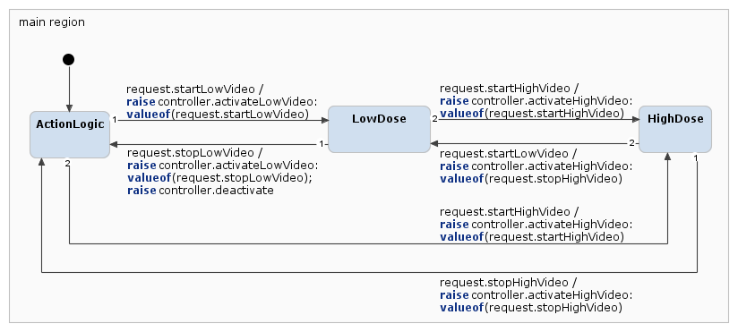
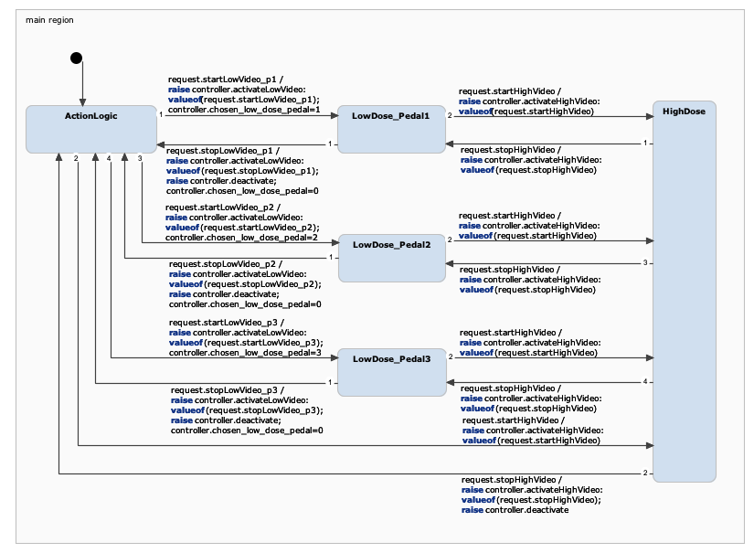

# FSM (Finite-State Machines)

## How to Import the *itemis CREATE* Projects

1. When starting *itemis CREATE*, select this repository as the workspace directory.
2. Once YAKINDU has launched, Click on `File > Import`.
3. Select `General > Existing Projects Into Workspace` and click `Next`.
4. Choose `Select root directory`.
5. Browse to this directory (the one which has subdirectories `one_plane/` and `two_plane/`).
6. Make sure both projects are selected (checkboxes are checked).
7. Click on `Finish`.
8. You should now be able to open the `Statechart.ysc` files.
   - If you get a pop-up about whether to Copy or Link the files, choose to link.

Project is for Interventional X-Ray System at Philips Healthcare
https://link.springer.com/chapter/10.1007/978-3-642-30729-4_19

### Hints
Make sure your diagram gives an insightful overview of the system.
Start by modelling the situation in which, at most, one pedal is pressed at the same time before modelling combinations
of pedal presses.
The assignment leaves some degrees of freedom in the logic to be modelled. If your model tends to get very complicated,
then please revisit the modelling decisions that you have made.

## FSM Model - 1-Plane System
### *Description*
1. FSM model for a 1-plane system.
   * In this model, the values of the events can be ignored.

### *Requirements*
For each itemis model, hand in the following items:
1. itemis CREATE project (as it is in the repository)
2. Screenshot of graphical statechart
3. Textual modelling decisions (see the important remark in the Introduction)

Upload your models to the 5-fsm directory. Both models have their own subdirectory. Instructions for how to import
the itemis CREATE projects can be found in the README.md file in the repository.

### Introduction

Figure 1 shows the FSM Model for a 1-Plane Interventional X-Ray System that provides real-time visual images based 
on X-Rays. As per assignment's description, Figure 1 aims to provide an insightful overview of the states that exist
within the 1-Plane System. 

There are two states, "LowDose" and "HighDose", which relate to the low dose of X-Ray pedal, and a high dose of X-Ray
pedal respectively. When the Low-Dose X-Ray pedal is pressed, The ActionLogic block will initiate a request.startLowVideo
and the controller.activateLowVideo will be raised to the value of request.startLowVideo. The ActionLogic block will
initiate a request.startHighVideo when the High-Dose X-Ray pedal is pressed.

The "LowDose" state can also progress to the "HighDose" state to address the requirement, "While using low-dose streaming
video; surgeons need to be able to temporarily switch to high-dose streaming video, without releasing the low-dose
streaming video pedal."

Figure 1. Statechart_1-Plane.png

### Modelling Decisions

1. As per the hints given, the team set the goal for the FSM - 1-Plane System to be insightful and not complicated.
   Hence, the team ensured that the number of states is minimal, yet sufficient. This also took into account the
   requirement that the "LowDose" state can still progress to the "HighDose" state. Transitions from one state to another
   are also carefully designed to ensure transition between states is smooth with no deadlock in a certain state. The
   state machine loop is also designed to be complete for the path to start and return to the start state(ActionLogic).

## FSM Model - 2-Plane System
### *Description*
2. FSM model for a 2-plane system.
   * In this model, the value of the events needs to be considered.
   * Use the interface that was given above. You do not need explicit toggle selection requests.

### Introduction
Figure 2 shows the FSM Model for a 2-Plane Interventional X-Ray System that provides real-time visual images based
on X-Rays. As per assignment's description, Figure 2 aims to provide an insightful overview of the states that exist
within the 2-Plane System.

As compared to the 1-Plane System, there are three pedals for Low-Dose X-Ray streaming video. Each pedal represents each
projection, which are "Frontal", "Lateral", and "Biplane" respectively. For readability purposes, "Frontal", "Lateral",
and "Biplane" are labelled "p1", "p2", and "p3" respectively.

As compared to the 1-Plane System, there are five states, 3 "LowDose" and 2 "HighDose", which relate to the 3 low dose  
X-Ray pedals - p1, p2, p3, and 2 high dose X-Ray pedals - high dose projection and high dose streaming video respectively.
When the Low-Dose X-Ray pedal is pressed, The ActionLogic block will initiate a request.startLowVideo and the
controller.activateLowVideo will be raised to the value of request.startLowVideo. The ActionLogic block will initiate
a request.startHighVideo when the High-Dose X-Ray pedal is pressed.

The "LowDose" state can also progress to the "HighDose" state to address the requirement, "While using low-dose streaming
video; surgeons need to be able to temporarily switch to high-dose streaming video, without releasing the low-dose
streaming video pedal."

Figure 1. statechart_2-Plane.png

### Modelling Decisions

1. As per the hints given, the team set the goal for the FSM - 2-Plane System to be insightful and not complicated.
   Hence, the team ensured that the number of states is minimal, yet sufficient. This also took into account the
   requirement that the "LowDose" state can still progress to the "HighDose" state. Transitions from one state to another
   are also carefully designed to ensure that transition between states is smooth with no deadlock in a certain state i.e.
   able to return to start state (ActionLogic).
2. Modelling decision for toggle pedals in round robin fashion to be added subsequently.

## Authors
[@Zhengtao Huang (5833469, zhengtaohuang)]() 
[@Barry Tee Wei Cong (5662834, btee)]()

## Acknowledgments
* [Part 2 Assignment 2 — FSM](https://cese.pages.ewi.tudelft.nl/software-systems/part-2/assignments/fsm.html)

