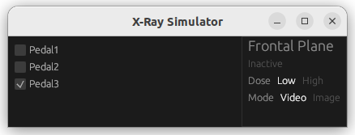

# DSL

## Importing this project

1. Open eclipse
2. Select this directory as the workspace
3. Click `File > Open Projects From File System ...`
4. Set the Import Source to this directory
5. Press Finish

Project is for Interventional X-Ray System at Philips Healthcare
https://link.springer.com/chapter/10.1007/978-3-642-30729-4_19

## DSL Model - Modelling Language
### *Description*
Use Eclipse Xtext to design a DSL so that a user of your language can choose between different options for the following 
aspects:

- Static configuration:
  - Choose the mapping between pedals and types of X-ray
  - Choose the order of projections when using the selection pedal
- Dynamic logic:
  - Choose the behavior of the selection pedal when other pedals are already pressed
  - Choose the behavior for combinations of X-ray requests with the same dose
  - Choose the behavior for combinations of X-ray requests with a different dose

This means that a user should be able to select whether they whether the selection pedal is ignored when other pedals 
are pressed, or whether some doses override others, or even whether some projections override others or combine (i.e. 
whether frontal + lateral = biplane).

This does not mean that you pick one of these. The user of your language should be able to choose.

### *Hints*
- You are not developing a (full-fledged) programming language.
- First, create example instances of your languages before creating a grammar.
- Think about the users of your language and how you would explain the dynamic logic to them.

### Introduction

Code Block below shows the Modelling Language for an Interventional X-Ray System that provides real-time visual images
based on X-Rays.

    grammar xray.XRayDSL with org.eclipse.xtext.common.Terminals
    
    generate xRayDSL "http://www.XRayDSL.xray"
    System: 'Static_Configuration:' configuration = Static_Configuration
    'Dynamic_Logic:' logic = Dynamic_Logic
    ;
    
    Dynamic_Logic:
    ('Combined_Pedal_Behaviour:' combinedpedal = Behaviours)?
    ('Same_Dose_Behaviour:' samedosebehaviour = Behaviours)?
    ('Different_Dose_Behaviour:' differentdosebehaviour = Behaviours)
    ;
    
    
    Static_Configuration: ThreePedals | SixPedals
    ;
    
    ThreePedals:'ThreePedal1:' pedal1 = Pedal
    'ThreePedal2:' pedal2 = Pedal
    'ThreePedal3:' pedal3 = Pedal
    ;
    SixPedals:  'SixPedal1:' pedal1 = Pedal
    'SixPedal2:' pedal2 = Pedal
    'SixPedal3:' pedal3 = Pedal
    'SixPedal4:' pedal4 = Pedal
    'SixPedal5:' pedal5 = Pedal
    'SixPedal6:' pedal6 = Pedal
    ;
    Pedal: 'Dose:' dose = Dose
    ('Projection:' projection = Projection)?
    ('Mode:' mode = Mode)?
    'Usage:' usage = Usage
    ;
    
    Behaviours: 'Behaviour:' behaviour= Behaviour
    ;
    
    enum Projection:
    ProjFrontal = 'Frontal' |
    ProjLateral = 'Lateral' |
    ProjBiplane = 'Biplane'
    ;
    
    enum Dose:
    DoseLow = 'Low'   |
    DoseHigh = 'High' |
    DoseUnused = 'Unused'
    ;
    
    enum Mode:
    ModeVideo = 'Video' |
    ModeImage = 'Image'
    ;
    
    enum Usage:
    Used = 'Used' |
    Unused = 'Unused'
    ;
    
    enum Behaviour:
    HighCombine = 'HighCombine' |
    HighOverride = 'HighOverride' |
    LowCombine = 'LowCombine' |
    LowOverride = 'LowOverride' |
    EarlyOverride = 'EarlyOverride'
    ;

    enum Order:
    FLB = 'FLB' |
    FBL = 'FBL' |
    BFL = 'BFL' |
    BLF = 'BLF' |
    LBF = 'LBF' |
    LFB = 'LFB'
    ;

### Modelling Decisions

1. Following the description provided for the modelling language, there exists the Static Configuration and the Dynamic
   Logic. Static Configuration will provide two types, one called ThreePedals and the other is called SixPedals. For
   ThreePedals, the team followed the functional examples section stated in the assignment webpage. Based on the default
   Configuration, both Pedal1 and Pedal2 points to Video Mode and are for low and high dose respectively. Pedal3 is
   indicated as unused.

2. For the SixPedals default configuration, Pedal1, Pedal2, and Pedal3 are meant for Low Doses in Frontal, Lateral, Biplane
   planes respectively. Pedal4 is used to toggle projection when no pedals are pressed. Pedal 5 and Pedal 6 are meant
   for High Doses in Video and Image modes respectively. The same explanation to the user will apply when updating the
   user on the Special Configuration for ThreePedals and SixPedals.

3. Based on the main.rs template provided, it can be known that Pedal1, Pedal2, and Pedal3 have three parameters, namely
   Projection, Dose, and Mode. Pedal4 only controls Projection, whereas Pedal5 and Pedal6 only control Dose and Mode.

4. Dynamic Logic will have three categories. The first will be Same Dose Behaviour. The second will be Different Dose
   Behaviour. The third will be Combined Pedal Behaviour. In the Behaviour, there are 5 enumerators. For example,
   HighOverride means when Low Dose Pedals are already pressed i.e. Pedal 1, Pedal2, and Pedal3, as long as Pedal5 and
   Pedal6 are pressed, it can let Dose switch from Low to High in the SixPedals Default Configuration. As for HighCombine,
   it means that when there is High Dose for Frontal and Lateral Planes, it will combine to output High Dose for Biplane.
   The same reasoning goes for LowOverride and LowCombine. In the case for EarlyOverride, this was created for the case
   of One Plane - Special Configuration where the earliest pressed pedal has priority.

5. Lastly, Order is to indicate the RoundRobin for the Projection to toggle in the SixPedal Configurations.

## DSL Model - Modelling Validation
### *Description*
Add model validation for early feedback to users of your language.

For example, your grammar might allow something for which it would be impossible to generate the correct code. Your 
validator should report this to the user and prevent code generation.

### Introduction
Modelling Validation is meant to check for errors for both the Static Configuration and the Dynamic Logic. For example
in the Static Configuration, ThreePedals configurations must only contain Frontal for the One Plane Configurations. This
is because only SixPedals can accommodate more than One Plane.

Next for the Dynamic Logic. For the SixPedals Configurations, the team decided to check the requirement of either High 
or Low Dose Overrides is allowed but not for EarlyOverride which is a Special Configuration for Three Pedal Special
Configuration.

    /*
    * generated by Xtext 2.33.0
    */
    package xray.validation

    import org.eclipse.xtext.validation.Check
    import xray.xRayDSL.Mode
    import xray.xRayDSL.Projection
    import xray.xRayDSL.SixPedals
    import xray.xRayDSL.ThreePedals
    import xray.xRayDSL.System
    import xray.xRayDSL.Behaviour

    /**
    * This class contains custom validation rules.
    *
    * See https://www.eclipse.org/Xtext/documentation/303_runtime_concepts.html#validation
    */
    class XRayDSLValidator extends AbstractXRayDSLValidator {

    @Check
    def checkThreeOrSixPedals(System system) {
        if (system.configuration instanceof ThreePedals){
            switch (system.configuration.pedal1.projection){
                case Projection::PROJ_LATERAL: {error("Only Frontal Allowed",null)}
                case Projection::PROJ_BIPLANE: {error("Only Frontal Allowed",null)}
                default: {
                }
        }
            switch (system.configuration.pedal2.projection){
                case Projection::PROJ_LATERAL: {error("Only Frontal Allowed",null)}
                case Projection::PROJ_BIPLANE: {error("Only Frontal Allowed",null)}
                default: {
                }
        }
            switch (system.configuration.pedal3.projection){
                case Projection::PROJ_LATERAL: {error("Only Frontal Allowed",null)}
                case Projection::PROJ_BIPLANE: {error("Only Frontal Allowed",null)}
                default: {
                }
        }
            switch (system.configuration.pedal1.mode){
                case Mode::MODE_IMAGE: {error("Only Video Allowed",null)}
                default: {
                }
        }
            switch (system.configuration.pedal2.mode){
                case Mode::MODE_IMAGE: {error("Only Video Allowed",null)}
                default: {
                }
        }
            switch (system.configuration.pedal3.mode){
                case Mode::MODE_IMAGE: {error("Only Video Allowed",null)}
                default: {
                }
        }
    }
        if (system.configuration instanceof SixPedals){
            switch (system.logic.differentdosebehaviour.behaviour){
                case Behaviour::EARLY_OVERRIDE: {error("Only HighOverride or LowOverride Allowed",null)}
                default: {
                }
            }
        }	    
    }
    //	public static val INVALID_NAME = 'invalidName'
    //
    //	@Check
    //	def checkGreetingStartsWithCapital(Greeting greeting) {
    //		if (!Character.isUpperCase(greeting.name.charAt(0))) {
    //			warning('Name should start with a capital',
    //					XRayDSLPackage.Literals.GREETING__NAME,
    //					INVALID_NAME)
    //		}
    //	}

    }

### Modelling Decisions
1. As per the requirement given, the team conducted Modelling Validation for both ThreePedals and SixPedals Configuration.
   The team tested the validator and switched the Projection for Pedal2 in One Plane to Lateral. The main.rs document
   code generation process was alerted on the Runtime Instance Application. Modelling Validator indicated an error 
   that only Frontal could be selected for One Plane, which meant the Validator worked.

## DSL Model - Code Generation
### *Description*
There is a simple Rust X-ray simulator crate that you should use. See the example at the bottom of this page for an 
implementation that demonstrates how to use the simulator and where to add your own pedal and X-ray action logic.

Create a code generator that generates such Rust files from your DSL. Your DSL should generate a Rust project which 
includes a Cargo.toml and a main.rs file located in src/.

Note: You are only required to do code generation for single-plane systems.
Your DSL is still required to support two-plane systems in the modelling language and validation, but you do not 
have to generate code for two-plane systems.

### *Hints*
- The amount of work for creating the code generator depends very much on the choices you have made for your grammar. 
  Make sure your code generator can at least generate two different regimes for the dynamic logic, and mention if 
  certain language features are not supported.
- First manually develop a piece of Rust code with your preferred code structure, and then copy this into a code 
  generator template and introduce the variation points based on your grammar.
- Validate your generated code by running it with the provided simple Rust-based simulator.

### Introduction
The team followed the hint and used the template main.rs file for modification purposes. Along with the Cargo.toml file,
the team developed a code that implemented the SixPedals Default Configuration. The team ensured the requirement that
"While using low-dose streaming video, surgeons need to be able to temporarily switch to high-dose streaming video." The
team also followed the logic for the SixPedals Default Configuration i.e. High Dose Overrides Low Dose. The team also
followed the requirement where selection pedal toggles only when no pedal is pressed. By following the hint, the team
managed to have a good understanding of the X-Ray Simulator that was provided.

The team then generated a main.rs code for the Single Plane Configurations before using it to develop the code for
XRayDSLGenerator.xtend and RUSTGenerator.xtend code shown below.

"XRayDSLGenerator.xtend"

    /*
    * generated by Xtext 2.33.0
      */
      package xray.generator
    
    import org.eclipse.emf.ecore.resource.Resource
    import org.eclipse.xtext.generator.AbstractGenerator
    import org.eclipse.xtext.generator.IFileSystemAccess2
    import org.eclipse.xtext.generator.IGeneratorContext
    
    /**
     * Generates code from your model files on save.
       *
         * See https://www.eclipse.org/Xtext/documentation/303_runtime_concepts.html#code-generation
         */
    class XRayDSLGenerator extends AbstractGenerator {
    
        override void doGenerate(Resource resource, IFileSystemAccess2 fsa, IGeneratorContext context) {
            val root = resource.allContents.head as Planning;
            if (root !== null) {
                var path = "generated/" + resource.getURI().lastSegment + "/"
                fsa.generateFile(path+"main.rs", RUSTGenerator.toRUST(root))
            if (root !== null) {
                var path = "generated/" + resource.getURI().lastSegment + "/"
                fsa.generateFile(path+"Cargo.toml", RUSTGenerator.toToml(root))
        }
    //		fsa.generateFile('greetings.txt', 'People to greet: ' +
    //			resource.allContents
    //				.filter(Greeting)
    //				.map[name]
    //				.join(', '))
        }
    }

"RUSTGenerator.xtend"

    /*
    * generated by Xtext 2.33.0
      */
      package xray.generator
    
    import xray.xRayDSL.System
    import xray.xRayDSL.ThreePedals
    import xray.xRayDSL.SixPedals
    
    abstract class RUSTGenerator {
    
    def static CharSequence toToml()'''
    [package]
    name = "example"
    version = "0.1.0"
    edition = "2021"
    
    [dependencies]
    # this is the simulation library
    tudelft-xray-sim = "1.0.0"
    
    # logging libraries
    simple_logger = "4.0.0"
    log = "0.4"
    '''
    
    def static CharSequence toRUST(xray.xRayDSL.System root)'''«»
    // Import types from the simulation library.
    use tudelft_xray_sim::*;
    // Import enum variants to make this example a bit easier to read.
    use Dose::*;
    use Mode::*;
    use Projection::*;
    
    use log::info;
    use tudelft_xray_sim::ThreePedals::{Pedal1, Pedal2, Pedal3};
    use crate::PedalUsage::{Unused, Used};
    use crate::UserPreference::{EarlyOverride, HighOverride, LowOverride};
    
    const DESIGN_CHOICE: UserPreference = «root.logic.differentdosebehaviour.behaviour»;
    const PEDAL1_USAGE: PedalUsage = «root.configuration.pedal1.usage»;
    const PEDAL2_USAGE: PedalUsage = «root.configuration.pedal2.usage»;
    const PEDAL3_USAGE: PedalUsage = «root.configuration.pedal3.usage»;
    
    
    fn main() {
    // Initialize logger.
    simple_logger::init().unwrap();
    // Run simulation with your own implementation of the control logic.
    run_single_plane_sim(Logic::default())
    }
    
    /// Example control logic for a two plane system.
    /// The pedal mapping is based on the example mapping given in the DSL assignment.
    #[derive(Default)]
    struct Logic {
    selected_dose: Dose,
    selected_mode: Mode,
    high_on: bool,
    low_on: bool,
    // you can have whatever other information that you want here
    }
    
    #[derive(PartialEq)]
    enum UserPreference {
    HighOverride,
    LowOverride,
    EarlyOverride,
    }
    
    #[derive(PartialEq)]
    enum PedalUsage{
    Used,
    Unused,
    }
    
    impl PedalMapper for Logic {
    /// We use an associated type to determine which pedal enum is used.
    /// Single-plane systems use the `ThreePedals` enum, while
    /// two-plane systems use `SixPedals`.
    /// Whether you used the correct type is checked at compile time.
    type Pedals = «type2Code(root.configuration)»;
    
        fn on_press(&self, pedal: Self::Pedals) -> Option<Request> {
            use «type2Code(root.configuration)»::*;
            match pedal {
                // 3 pedals for low dose X-ray streaming video (one for each projection)
                Pedal1 => {
                    if PEDAL1_USAGE == Used {
                        Some(Request::start(«root.configuration.pedal1.projection»,«root.configuration.pedal1.dose»,«root.configuration.pedal1.mode»))
                    } else {
                        None
                    }
                },
                Pedal2 => {
                    if PEDAL2_USAGE == Used {
                        Some(Request::start(«root.configuration.pedal2.projection»,«root.configuration.pedal2.dose»,«root.configuration.pedal2.mode»))
                    } else {
                        None
                    }
                },
                Pedal3 => {
                    if PEDAL3_USAGE == Used {
                        Some(Request::start(«root.configuration.pedal3.projection»,«root.configuration.pedal3.dose»,«root.configuration.pedal3.mode»))
                    } else {
                        None
                    }
                }
            }
        }
    
        fn on_release(&self, pedal: Self::Pedals) -> Option<Request> {
            use «type2Code(root.configuration)»::*;
            match pedal {
                Pedal1 => {
                    if PEDAL1_USAGE == Used {
                        Some(Request::stop(«root.configuration.pedal1.projection»,«root.configuration.pedal1.dose»,«root.configuration.pedal1.mode»))
                    } else {
                        None
                    }
                },
                Pedal2 => {
                    if PEDAL2_USAGE == Used {
                        Some(Request::stop(«root.configuration.pedal2.projection»,«root.configuration.pedal2.dose»,«root.configuration.pedal2.mode»))
                    } else {
                        None
                    }
                },
                Pedal3 => {
                    if PEDAL3_USAGE == Used {
                        Some(Request::stop(«root.configuration.pedal3.projection»,«root.configuration.pedal3.dose»,«root.configuration.pedal3.mode»))
                    } else {
                        None
                    }
                }
            }
        }
    }
    
    impl ActionLogic<false> for Logic {
    /// Naive implementation of request handling which does not handle
    /// multiple pedals being pressed at once.
    fn handle_request(&mut self, request: Request, controller: &mut Controller<false>) {
    // This is how you can get access to the planes in case you want to inspect their status.
    
            // Custom logging of requests.
            info!("Processing request: {request:?}");
    
            // In your own code (as well as the code that you generate),
            // you should do checks before using the controller to
            // start and stop X-rays.
            match request {
                Request::Start {
                    projection,
                    dose,
                    mode,
                } => {
                    if dose == High {
                        if DESIGN_CHOICE == HighOverride {
                            self.selected_dose = dose;
                            self.selected_mode = mode;
                            self.high_on = true;
                            if self.low_on == false {
                                controller.activate_frontal(dose, mode);
                            } else {
                                controller.deactivate_xray();
                                controller.activate_frontal(dose, mode);
                            }
                        } else if DESIGN_CHOICE == LowOverride || DESIGN_CHOICE == EarlyOverride {
                            self.high_on = true;
                            if self.low_on == false {
                                self.selected_dose = dose;
                                self.selected_mode = mode;
                                controller.activate_frontal(dose, mode);
                            }
                        }
                    } else if dose == Low {
                        if DESIGN_CHOICE == LowOverride {
                            self.selected_dose = dose;
                            self.selected_mode = mode;
                            self.low_on = true;
                            if self.high_on == false {
                                controller.activate_frontal(dose, mode);
                            } else {
                                controller.deactivate_xray();
                                controller.activate_frontal(dose, mode);
                            }
                        } else if DESIGN_CHOICE == HighOverride || DESIGN_CHOICE == EarlyOverride {
                            self.low_on = true;
                            if self.high_on == false {
                                self.selected_dose = dose;
                                self.selected_mode = mode;
                                controller.activate_frontal(dose, mode);
                            }
                        }
                    }
                }
                Request::Stop {
                    projection,
                    dose,
                    mode, } => {
                    if dose == High {
                        self.high_on = false;
                        if self.low_on {
                            controller.deactivate_xray();
                            controller.activate_frontal(Low, Video);
                        } else {
                            controller.deactivate_xray();
                        }
                    } else {
                        self.low_on = false;
                        if self.high_on {
                            controller.deactivate_xray();
                            controller.activate_frontal(High, Video);
                        } else {
                            controller.deactivate_xray();
                        }
                    }
                }
                _ => {}
            }
        }
    }
    '''
    
            def static dispatch type2Code(ThreePedals pedal)'''
                ThreePedals'''
    
            def static dispatch type2Code(SixPedals pedal)'''
                SixPedals'''
    }

### Modelling Decisions (Proven by Screenshots of X-Ray Simulator)
1. const DESIGN_CHOICE: UserPreference = «root.logic.differentdosebehaviour.behaviour»; is an option for the user to 
   decide whether HighOverride or EarlyOverride to choose between Default or Special Configuration for ThreePedals 
   Configuration. By choosing HighOverride, the main.rs file for ThreePedals underwent simulation with the Rust-based 
   simulator via command cargo run. The screenshots below show that Pedal3 is unused and hence the status in Inactive. 
   Pedal1 will trigger Low Dose and Pedal2 will trigger High Dose. When both Pedal1 and Pedal2 are pressed, High Dose 
   will override Low Dose.
2. const PEDAL1_USAGE: PedalUsage = «root.configuration.pedal1.usage»;

   const PEDAL2_USAGE: PedalUsage = «root.configuration.pedal2.usage»;

   const PEDAL3_USAGE: PedalUsage = «root.configuration.pedal3.usage»;

   The three constants will allow the user to decide whether any of the pedal can be configured to be unused. Once set
   to unused, the pedal will be set to None and not have any effect.
 

Figure 1. ThreePedals - Default Configuration - Pedal1.png

Figure 2. ThreePedals - Default Configuration - Pedal2.png

Figure 3. ThreePedals - Default Configuration - Pedal1 and Pedal 2.png

Figure 4. ThreePedals - Default Configuration - Pedal3.png

## Authors
[@Zhengtao Huang (5833469, zhengtaohuang)]() 
[@Barry Tee Wei Cong (5662834, btee)]()

## Acknowledgments
* [Part 2 Assignment 3 — DSL](https://cese.pages.ewi.tudelft.nl/software-systems/part-2/assignments/dsl.html)

